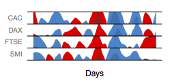

# Horizon Graph

Prototype of a horzion graph implementation based on ggplot2.

The idea came up by Saito and Heer. See 2009's CHI paper: `Sizing the Horizon: The Effects of Chart Size and Layering on the Graphical Perception of Time Series Visualizations` by Heer et al.

A smoothed horizon graph of the first 200 days of the EU dataset:

